**Note the exact positions of the three backticks (```` ``` ````):**

1. **Line 1**: ` ```bash ` — opens the code block
2. **Line 4**: ` ``` ` — closes the code block
3. **Line 6**: `## 📱 Screenshots` — now outside the block, will render as a header

---

## 🔧 Also Fix These Two Issues

While you're editing `README.md`, fix these two:

### 1. Clone URL has extra spaces and angle brackets

**Current:**
```
git clone < https://github.com/Shahid-Momin/laza-ecommerce>
```

**Fix:**
```
git clone https://github.com/Shahid-Momin/laza-ecommerce.git
```

### 2. `Architecture` section is missing a diagram

**Current:**
```
## 🏗 Architecture

Clean layered architecture:

- **UI layer** — dumb widgets, only rendering + user events
- **BLoC layer** — business logic; converts events into states
...
```

Add the ASCII diagram right after "Clean layered architecture:" and before the bullet list:

```
## 🏗 Architecture

Clean layered architecture:

```
UI (screens/widgets)
↓
State Management (BLoC)
↓
Repositories
↓
Services (Firebase / REST API)
↓
Models
```

- **UI layer** — dumb widgets, only rendering + user events
- **BLoC layer** — business logic; converts events into states
- **Repository layer** — abstracts data sources; one per domain (auth, product, cart…)
- **Service layer** — thin wrappers over Firebase and Dio
- **Model layer** — pure data classes with `fromJson` / `toFirestore`
```

---

## 📄 Complete Corrected README (Copy-Paste This Entire File)

To avoid any mistakes, replace your whole `README.md` with this:

````markdown
# Laza — Personalized E-Commerce Mobile App

A production-style Flutter e-commerce app built for the Flutter Developer
Assignment. Features Firebase Authentication, Cloud Firestore CRUD, REST API
integration (DummyJSON), BLoC state management, and a full Figma-matched UI.

---

## 🎬 Features

- **Authentication** — Email/password + Google Sign-In, forgot password flow, persistent session
- **Onboarding** — Gender selection + interests personalization
- **Home** — Product listing from DummyJSON with categories, brands, search
- **Search** — Live API search with debounce, loading/error/empty states
- **Product Details** — Images, rating, sizes, description, reviews
- **Wishlist** — Firestore-backed add/remove
- **Cart** — Quantity management, subtotal, shipping, checkout
- **Orders** — Firestore-backed order history
- **Profile** — Edit user details, upload profile picture, view orders
- **Analytics** — Dashboard with line/donut/bar charts
- **Dark Mode** — Global theme with persistence

---

## 🛠 Tech Stack

- **Flutter** 3.10+ / Dart 3.10+
- **Firebase** — Auth, Cloud Firestore
- **Dio** — HTTP client
- **flutter_bloc** — State management
- **shared_preferences** — Local persistence
- **fl_chart** — Analytics visualizations
- **image_picker** + **path_provider** — Profile picture

---

## 🏗 Architecture

Clean layered architecture:

```
UI (screens/widgets)
      ↓
State Management (BLoC)
      ↓
Repositories
      ↓
Services (Firebase / REST API)
      ↓
Models
```

- **UI layer** — dumb widgets, only rendering + user events
- **BLoC layer** — business logic; converts events into states
- **Repository layer** — abstracts data sources; one per domain (auth, product, cart…)
- **Service layer** — thin wrappers over Firebase and Dio
- **Model layer** — pure data classes with `fromJson` / `toFirestore`

---

## 🚀 Setup Instructions

### 1. Prerequisites

- Flutter SDK 3.10+
- Android Studio or VS Code
- A Firebase account

### 2. Clone the repo

```bash
git clone https://github.com/Shahid-Momin/laza-ecommerce.git
cd laza
flutter pub get
```

### 3. Run the app

```bash
flutter run
```

---

## 📱 Screenshots

| Splash | Onboarding | Get Started | Sign Up |
|:------:|:----------:|:-----------:|:-------:|
|  | 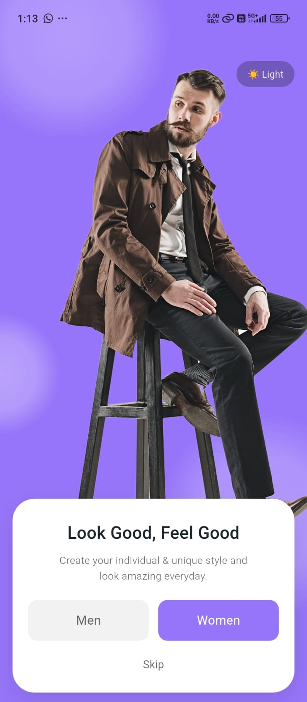 | 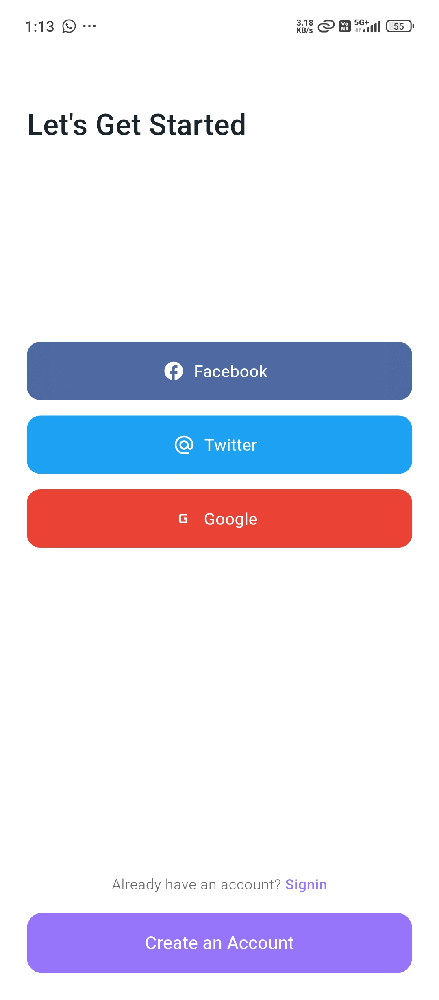 | 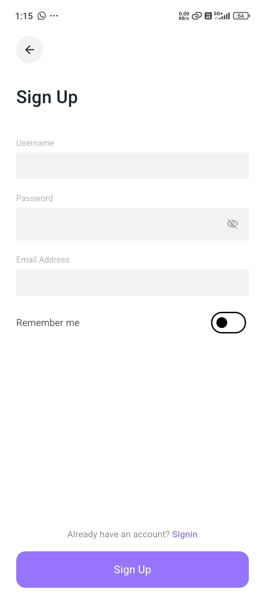 |

| Login | Interests | Home | Cart |
|:-----:|:---------:|:----:|:----:|
| 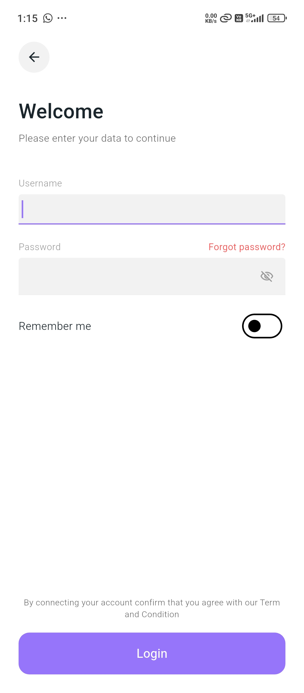 | 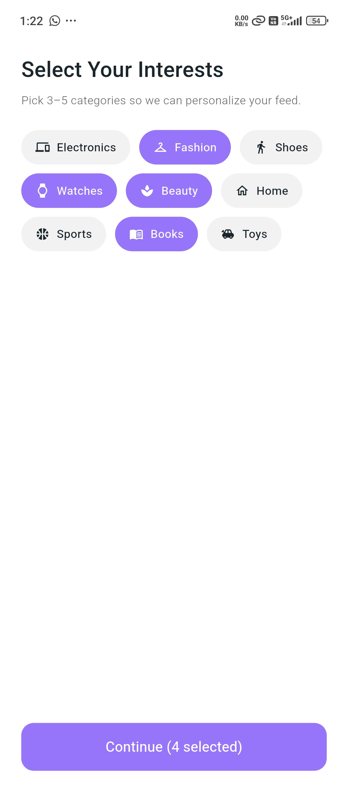 | 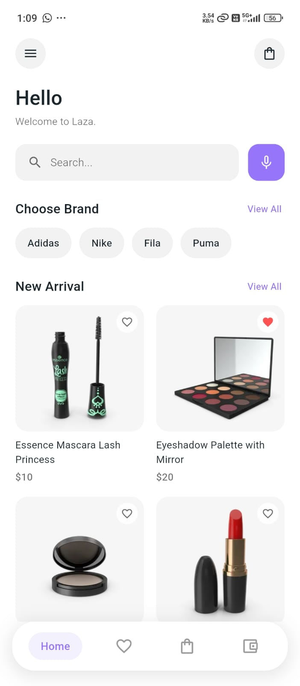 | 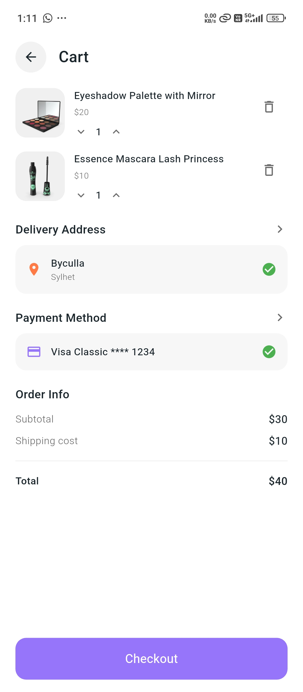 |

| Order Confirmed | My Orders | Profile | Analytics |
|:---------------:|:---------:|:-------:|:---------:|
| 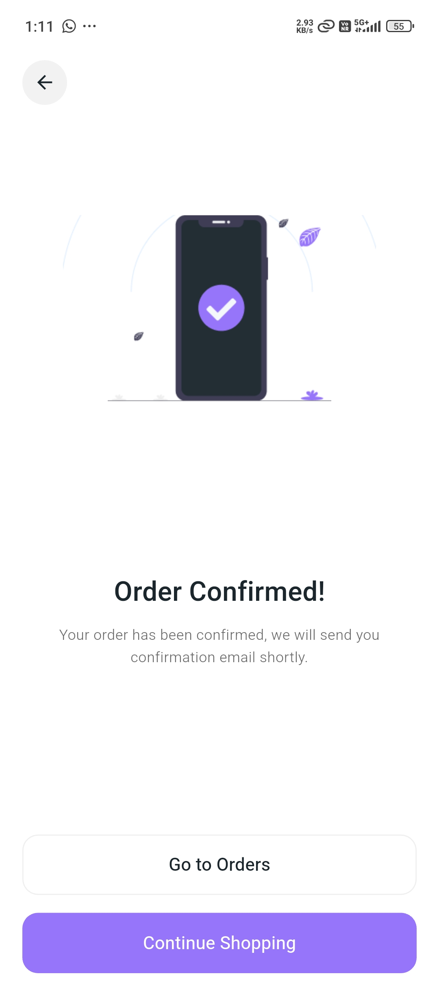 | 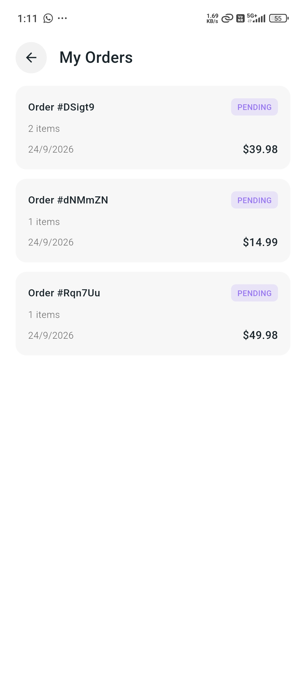 | 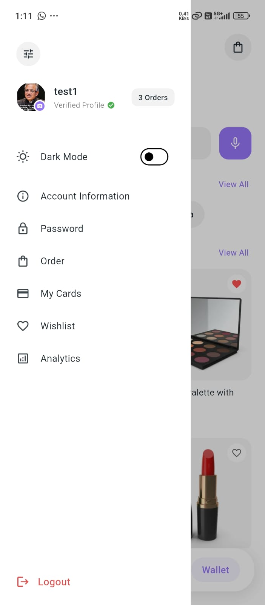 | 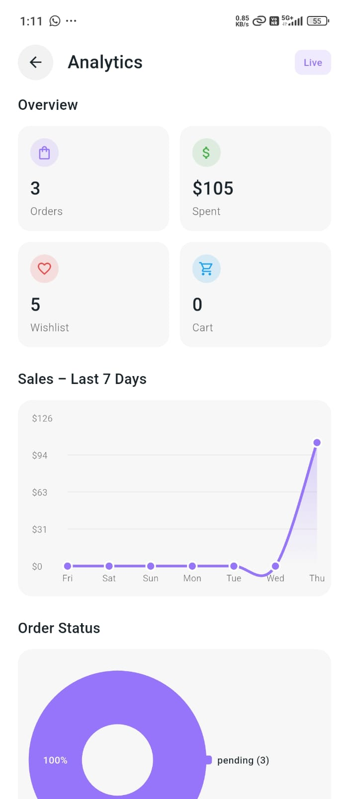 |

| Account Info | Add Address | Add Payment | Forgot Password |
|:------------:|:-----------:|:-----------:|:---------------:|
| 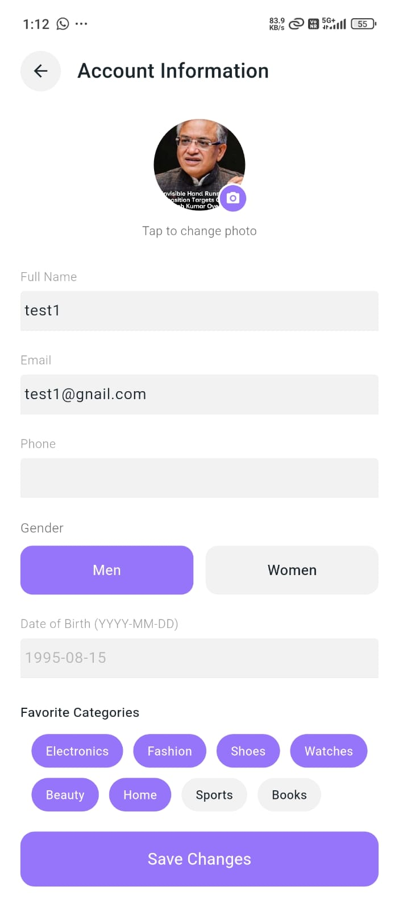 | 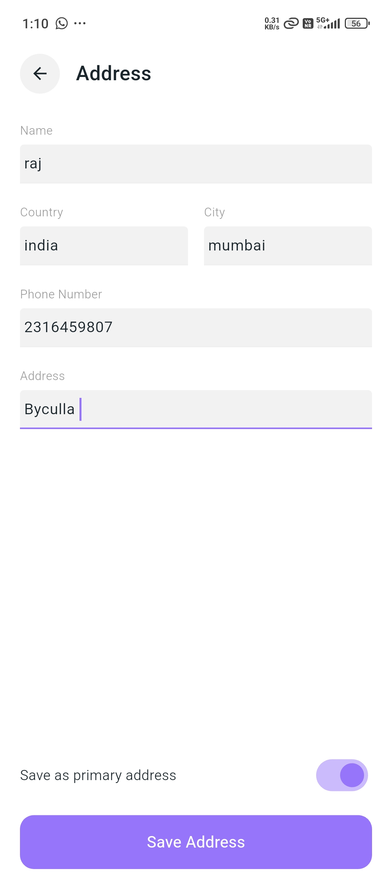 | 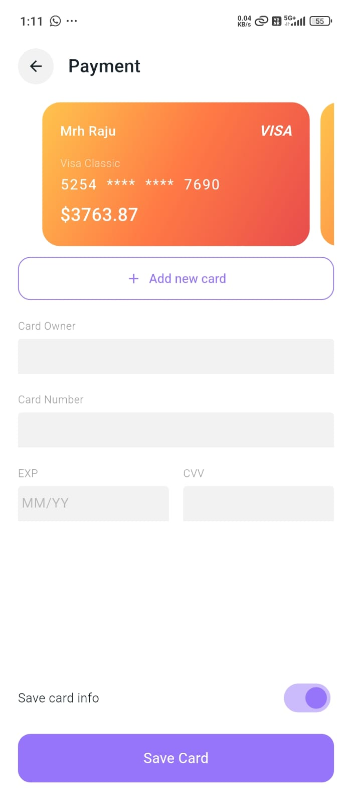 | 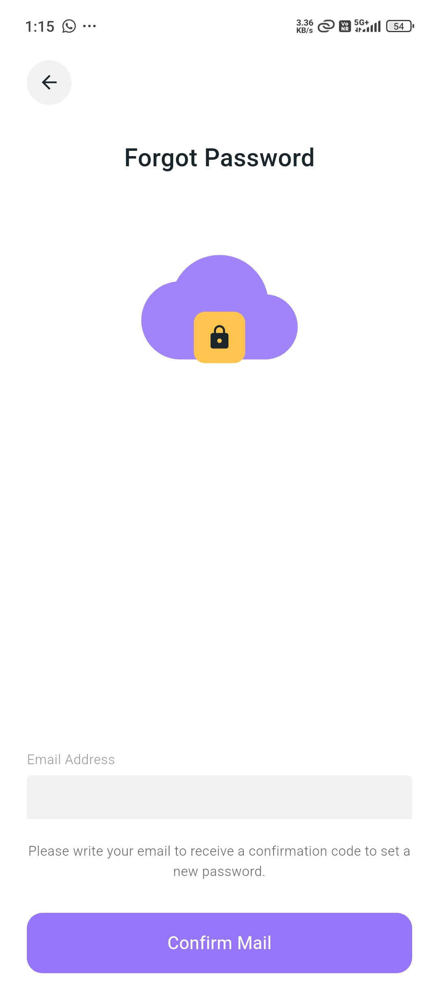 |

| New Password | Verification Code |
|:------------:|:-----------------:|
| 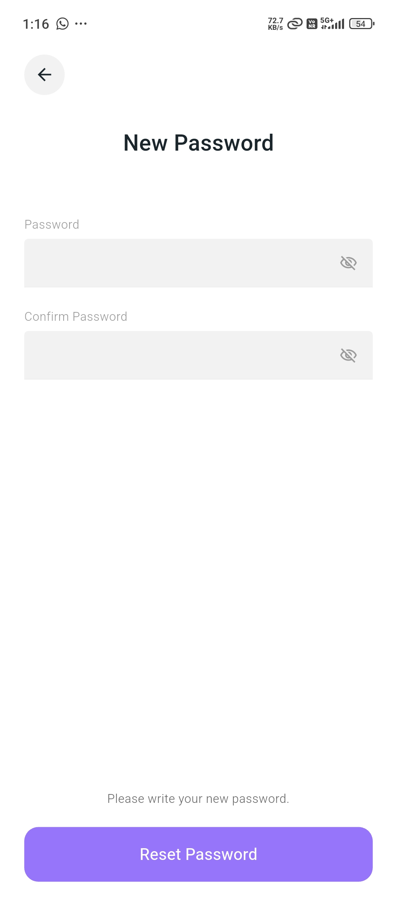 | 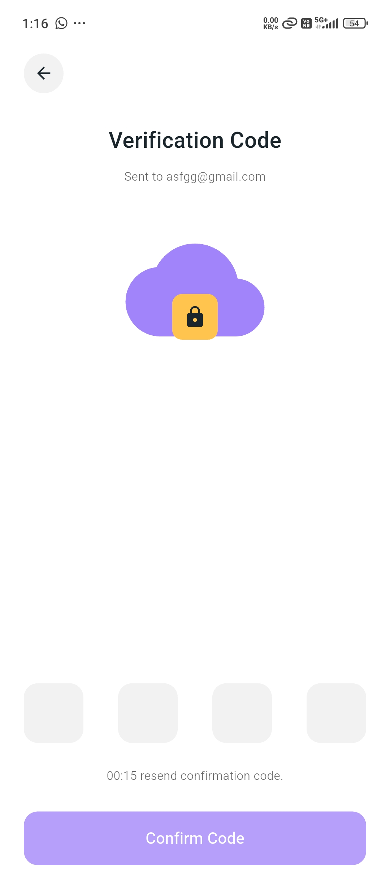 |

---

## 👤 Author

**Shahid Momin**
- GitHub: [@Shahid-Momin](https://github.com/Shahid-Momin)